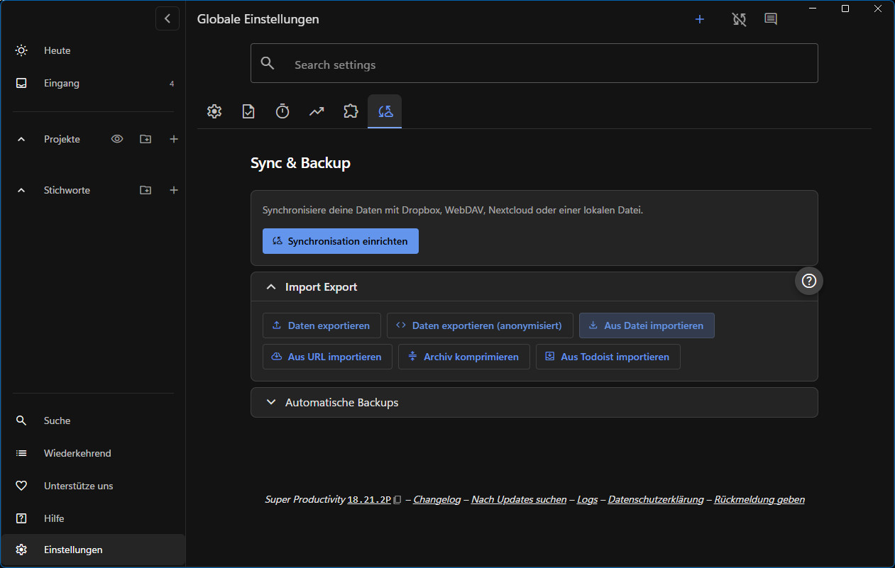
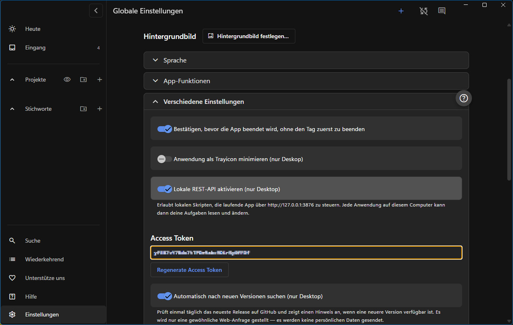

# LMS → Super Productivity

Importiert Viona-Aufgaben in Super Productivity und zeigt erledigte Abgaben im LMS an

## Einrichtung

### 1. Super Productivity installieren

- [Super Productivity herunterladen](https://super-productivity.com/download/)

### 2. Tampermonkey installieren

Installiere das Tampermonkey-Add-on für deinen Browser:

- [Tampermonkey für Chrome](https://chromewebstore.google.com/detail/tampermonkey/dhdgffkkebhmkfjojejmpbldmpobfkfo?hl=de)
- [Tampermonkey für Firefox](https://addons.mozilla.org/de/firefox/addon/tampermonkey/)

### 3. Tampermonkey-Script installieren

Installiere das aktuelle [Tampermonkey-Script](https://github.com/HS-Studio/lms-lerning-tampermonkey/raw/refs/heads/main/LMS_Super_Productivity-0.6.user.js).

### 4. Super Productivity einrichten

- Lade das [Super Productivity Template](https://github.com/HS-Studio/lms-lerning-tampermonkey/releases/download/v0.6/sp-mediengestalter_template.json) herunter.
- Starte Super Productivity und klicke auf **„Einfache Aufgabenliste“**.
- Öffne die **Einstellungen** und wechsle zum letzten Tab **„Sync & Backup“**.
- Klappe **„Import Export“** auf und klicke auf **„Aus Datei importieren“**.
- Wähle das zuvor heruntergeladene Template aus.
- Wechsle anschließend zum ersten Tab **„Allgemein“**.
- Klappe **„Verschiedene Einstellungen“** auf und aktiviere die **„Lokale REST-API“**.
- Kopiere den anschließend angezeigten **Access Token**.

### 5. Zusätzliche Einstellung für Chrome

Dieser Schritt ist **nur für Chrome-Nutzer** erforderlich:

- Öffne die [Chrome-Erweiterungen](chrome://extensions/).
- Öffne die **Details** von Tampermonkey.
- Aktiviere **„Nutzerscripts zulassen“**.

### 6. Tampermonkey konfigurieren

- Öffne die **Viona-Projektabgabenseite**.
- Klicke auf das **Tampermonkey-Symbol** und anschließend auf **„Super Productivity konfigurieren“**.
- Füge den zuvor kopierten Access Token in den sich öffnenden Dialog ein.

### 7. Aufgaben importieren

- Klicke unten rechts auf der Projektabgabenseite auf **„An Super Productivity senden“**.
- Bestätige den Import.

Die Aufgaben werden nun den entsprechenden Projekten in Super Productivity zugeordnet.

Wenn Aufgaben in Super Productivity abgehakt werden, werden sie auf der Vionaseite durchgestrichen.

***

 

